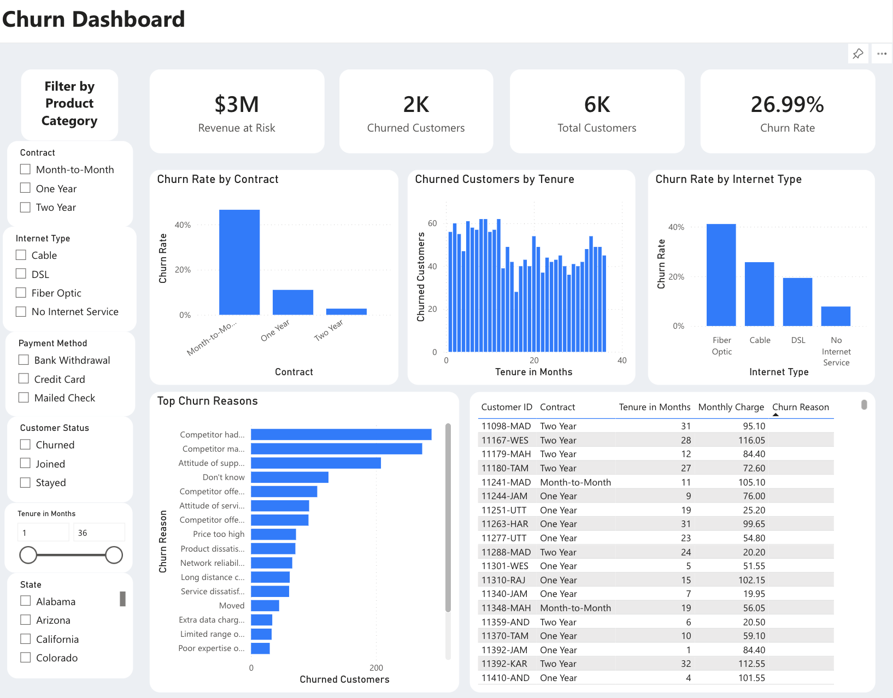

# Telecom Customer Churn Analysis

A data analytics project focused on identifying customer churn drivers, quantifying revenue at risk, and delivering actionable insights through SQL data pipelines and a Power BI dashboard.

## Business Objective

This project analyzes telecom customer churn to identify key drivers of attrition, high-risk customer segments, and revenue impact, in order to support targeted retention strategy.

## Key Questions

- Which contract types, internet service types, and payment methods have the highest churn rates?
- How much revenue is at risk due to churn?
- What are the leading reasons customers churn?
- Which customer segments should be prioritized for retention efforts?

## Key Findings

- **Overall churn rate is 26.99%**, representing roughly $3M in revenue at risk across the customer base.
- **Month-to-Month contract customers churn at a significantly higher rate** than One Year or Two Year contract holders, making contract length a strong retention predictor.
- **Fiber Optic internet customers churn more than Cable or DSL customers**, suggesting service quality or pricing concerns.
- **Competitor-related reasons (better offers, devices, pricing) are the leading cause of churn**, pointing to competitive pressure rather than internal service failures as the primary driver.

See [`executive-summary/executive_summary.md`](executive-summary/executive_summary.md) for full findings and recommendations.

## Dashboard Preview



## Project Structure

```
churn-analysis/
├── README.md
├── data/
│   └── customer_data.csv & prod_data.csv
├── sql/
│   ├── 01_staging_table.sql
│   ├── 02_data_cleaning.sql
│   └── 03_create_views.sql
├── powerbi/
│   ├── Churn Dashboard.pbix
│   └── Screenshot.png
└── executive-summary/
    └── executive_summary.md
```

## Folder Overview

- **data/** - Raw customer and product data used for the analysis
- **sql/** - SQL scripts for staging, cleaning, and creating analytical views
- **powerbi/** - Power BI dashboard file for visualizing churn metrics
- **executive-summary/** - High-level summary of findings and recommendations

## Tools Used

- SQL (data staging, cleaning, and view creation)
- Power BI / DAX (dashboard visualization and custom measures)

## Workflow

1. Load raw data into `data/`
2. Run SQL scripts in order (`01` → `02` → `03`) to stage, clean, and create views
3. Connect Power BI dashboard to the cleaned views
4. Review findings in the executive summary

## Limitations

This analysis is based on a single snapshot of customer data (6,418 records) rather than time-series transaction history, so churn trends over time cannot be directly measured. Future iterations should incorporate historical, time-stamped data to track churn rate changes and campaign effectiveness over time.
